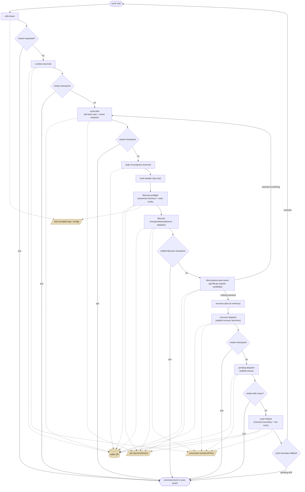

# Watch cycle phases

This describes what `gza watch`'s main loop actually does, derived from
`src/gza/cli/watch.py`. It's a descriptive account of current behavior, not a
spec of intended behavior; regenerate/re-verify against source when watch.py
changes materially, since nothing keeps this in sync automatically.

## The loop

`_run_cycle` (`watch.py:16597`) is the body of one single-project iteration.
It runs phases in this order, once per iteration:

drift-check -> runtime-reconcile -> cycle-plan -> stale-no-progress-reconcile
-> cycle-header -> lifecycle-preflight -> lifecycle ->
blind-parked-auto-rearm -> recovery-plan -> recovery-dispatch ->
pending-dispatch -> cycle-finalize

A **safe restart checkpoint** is the point after a phase or dispatch unit has
completed and its durable bookkeeping, launch reservation state, checkout state,
and lease state are settled, before another mutating unit starts. Installed-code
drift can request re-exec at those checkpoints instead of waiting for a full
cycle boundary. The outer command loops (`watch.py:20771` for the fleet loop,
`:21304` for single-project) still make the final `_should_reexec_watch`
decision immediately before `execv`, so dry-run/manual mode and stop signals
remain authoritative.

Fleet watch uses the same project-local direct phases but adds global barriers
in `run_watch_supervisor_fleet_cycle` (`watch.py:10852`): reconcile/observe all
selected runtimes, analyze all enabled runtimes, run direct phases in order,
then dispatch recovery and pending candidates incrementally through the shared
launch budget. A restart request from one completed direct phase stops later
direct runtimes and all fleet dispatch; a request after a settled fleet
candidate stops selection of another candidate while preserving completed
strategy advancement and the lease set for re-exec.

## Phases

**drift-check** (`watch.py:16702`) - Compares the installed `gza` package
against the cached startup fingerprint and updates the drift state. Disk-only
package stat/hash work. If drift is already pending and auto-restart is allowed,
this checkpoint can return immediately before runtime reconciliation, planning,
verify, lifecycle, recovery, or pending dispatch starts.

**runtime-reconcile** (`watch.py:16713`) - Reconciles persisted runtime state
against actual running processes: PID liveness checks, clearing orphaned worker
rows, and runtime occupancy bookkeeping. DB reads/writes plus process-liveness
checks. Moderate cost, skippable via `skip_runtime_reconcile`. A completed
reconcile is a restart checkpoint.

**cycle-plan** (`watch.py:16474`, phase at `:16500`) - Builds the scheduling
picture for the cycle: pulls a concurrency snapshot, scans pending tasks and
blocking dependencies, then runs `_analyze_watch_cycle` (`watch.py:14818`).
That analysis builds lineage/recovery indexes, tag-scope gaps, owner rows,
non-dropped implement sources, and recovery candidates. Broad scopes still pay
O(#tasks) snapshot cost, while expensive owner action work tracks retained
scoped owners plus conservative terminal-reroot candidates. A completed plan is
a restart checkpoint.

**stale-no-progress-reconcile** (`watch.py:16772`) - Scans parked tasks scoped
by owner/task selectors and clears stale "no progress" parks. Pure DB
read/update; cost scales with parked rows. A completed reconcile is a restart
checkpoint.

**cycle-header** (`watch.py:16833`) - Emits the `WAKE` line plus scope, usage,
and unit-accounting summaries from already-computed data. Mostly formatting and
logging. A completed header is a restart checkpoint.

**lifecycle-preflight** (`watch.py:17306`) - Checks the canonical checkout
boundary, refreshes the isolated worktree if isolation is enabled, and may call
the main integration verify gate, which can run the project's full verify/test
suite with bounded reruns when cached evidence is stale or red. DB/git/disk work
plus potentially expensive subprocess verification. A completed preflight is a
restart checkpoint.

**lifecycle** (`watch.py:17511`) - Dispatches direct lifecycle actions selected
by the shared advance engine: merge, merge-with-followups, rebase routing,
review/improve creation, needs-attention, skips, and direct repairs. It can
check out branches, run candidate verify, promote isolated merge batches, spawn
rebase/review/improve workers, and settle deferred lifecycle starts. The
checkpoint is after deferred lifecycle launches have settled and the canonical
checkout boundary is safe, not inside merge/promotion/finalization work.

**blind-parked-auto-rearm** (`watch.py:18502`, logic at `:15462`) - Resolves
the target branch SHA, discovers parked tasks matching scope/tags, and probes
each candidate with git diff evidence before re-arming it. If anything rearms,
it reruns `_analyze_watch_cycle` to refresh state. Cost is one target ref
resolution plus per-candidate git probes; the completed phase is a restart
checkpoint.

**recovery-plan** (`watch.py:18633`) - Iterates recovery attention,
undispatched, skip, and candidate rows already computed during cycle analysis.
Emits log/attention events and prepares in-memory dispatch plans. Mostly cheap
bookkeeping over DB-derived in-memory state. A completed recovery plan is a
restart checkpoint.

**recovery-dispatch** (`watch.py:19712`) - Launches recovery workers for failed
tasks selected by the recovery plan. It reserves launch permits, prepares or
creates recovery tasks, spawns worker/iterate processes, waits for deferred
starts to settle, records confirmed-start counts, and releases/consumes slots.
The restart checkpoint is after all deferred recovery starts in that dispatch
unit have settled.

**pending-dispatch** (`watch.py:19910`) - Recomputes the pending runnable queue,
handles quiet-period skips, preflights pending candidates, reserves launch
permits, spawns worker/iterate processes, and settles each complete dispatch
wave before selecting more pending work. A restart checkpoint runs after every
settled pending wave, never between permit reservation, task preparation, spawn,
and settlement.

**cycle-finalize** (`watch.py:20308`; direct-phase copy at `:18581`) - Final
bookkeeping: pending-count query, canonical-checkout boundary check,
main-verify attention finalization, deferred-blocker/attention summaries, log
cycle close, and a final live-process scan for running/starting worker counts.
The outer loop then diffs this cycle's task snapshot against the previous one
to emit transition events and process expected-start boundary observations.

## Diagram

Phase order plus the external systems each phase touches: the task/runtime DB
(`.gza/gza.db`, sqlite), `git` subprocesses against repos/worktrees, installed
package/config files on disk, and OS process liveness/spawn state.

## Why cycles take minutes

Three phases dominate wall-clock time, and all three share the same underlying
pattern: cheap DB reads around expensive subprocess or per-item work.

- **cycle-plan**: full task-table snapshot and owner analysis every cycle, plus
  git/status probes for retained owner-action candidates.
- **lifecycle-preflight**: can run the actual verify/test suite against main
  when cached checkpoint evidence is stale or needs bounded red confirmation.
- **lifecycle** and **blind-parked-auto-rearm**: lifecycle may merge, verify,
  promote, or spawn workers; auto-rearm can run one git diff per parked
  candidate and repeat cycle analysis after rearming.

The checkpoint checks reuse the existing installed-package fingerprint cache, so
unchanged checks normally pay directory/stat traversal cost rather than
rehashing every Python file. They run only at completed phase or settled
dispatch boundaries, not from heartbeat ticks.

## Related

- `specs/behavior/watch-supervisor.md` - prescriptive intent for drift/re-exec,
  safe restart checkpoints, fleet state preservation, and idle behavior.
- `docs/configuration.md` - operator-facing watch flags, auto-restart wording,
  and the high-level lifecycle/recovery/dispatch behavior.
