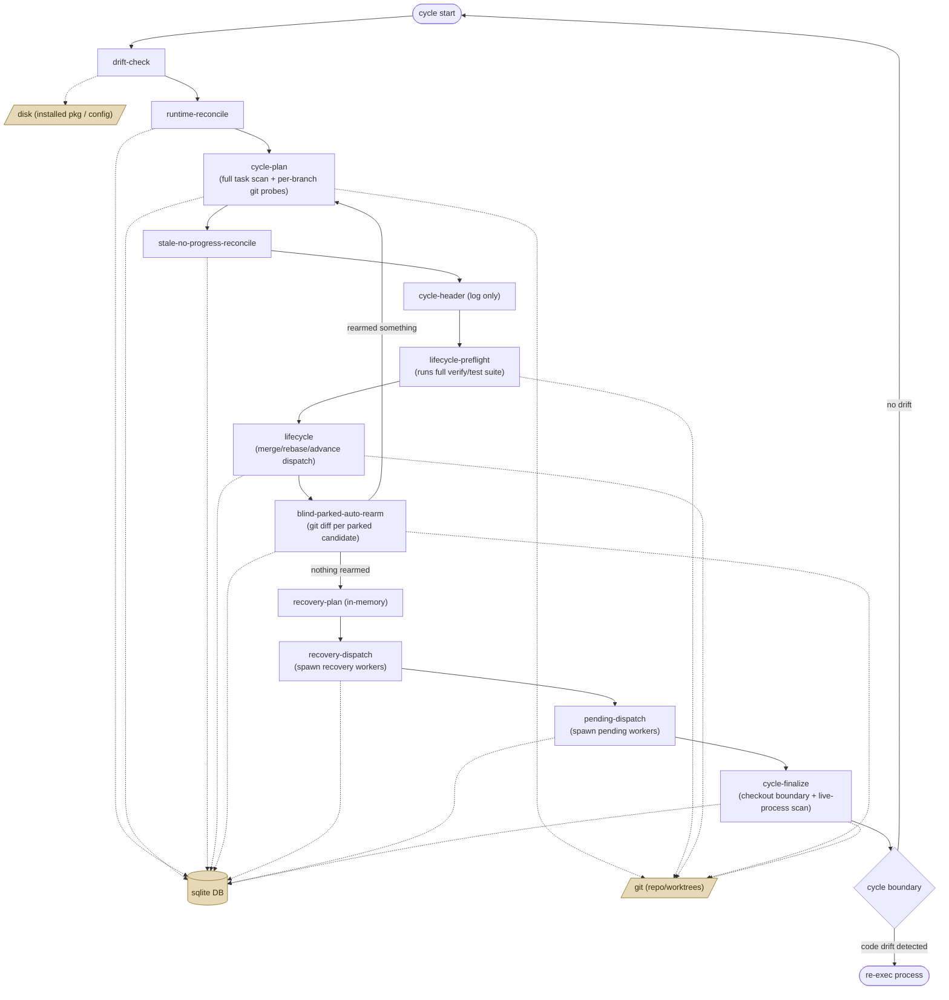

# Watch cycle phases

This describes what `gza watch`'s main loop actually does, derived from
`src/gza/cli/watch.py`. It's a descriptive account of current behavior, not a
spec of intended behavior — regenerate/re-verify against source when watch.py
changes materially, since nothing keeps this in sync automatically.

## The loop

`_run_cycle` (`watch.py:15466`) is the body of one iteration. It runs phases
in this order, once per iteration:

drift-check → runtime-reconcile → (build/reuse cycle plan) →
stale-no-progress-reconcile → cycle-header → lifecycle-preflight → lifecycle →
recovery-plan → recovery-dispatch → pending-dispatch → cycle-finalize

A **cycle boundary** is the point after one full iteration returns, inside the
outer `while` loop (`watch.py:19513` for the fleet loop, `:20245` for
single-project). Anything that needs to restart the process (like picking up
newly-installed code) waits for this boundary rather than interrupting a
phase mid-flight, because several phases mutate DB/git state that assumes
each phase runs to completion before the next begins.

## Phases

**drift-check** (`watch.py:15506`) — Compares the installed `gza` package
against a cached snapshot taken when watch started. Version/hash comparison
only, no DB or subprocess work. Near-instant; just emits the "will re-exec at
next cycle boundary" warning when code has changed underneath it.

**runtime-reconcile** (`watch.py:15517`) — Reconciles persisted runtime state
against actual running processes: PID liveness checks, clearing orphaned
worker rows. DB reads/writes plus process-liveness checks. Moderate cost,
skippable via `skip_runtime_reconcile`.

**cycle-plan** (`watch.py:15223`, invoked from `_build_reported_watch_cycle_plan`
at `:15349`) — Builds the scheduling picture for the cycle: pulls a
concurrency snapshot (running tasks, filtering hidden internal tasks like
`behavior-monitor`), scans all pending tasks and checks blocking dependencies
per task, then runs `_analyze_watch_cycle` (`watch.py:14056`) — the expensive
part. That still does a full task-table scan to build lineage/recovery
indexes, tag-scope gaps, non-dropped implement sources, owner rows, and
recovery candidates. Tag-filtered owner-row analysis now prunes ordinary
out-of-scope owners before lifecycle/recovery action resolution, branch
priming, and most git probes; the full snapshot remains O(#tasks), while
expensive owner action work tracks the retained scoped owners plus
conservative terminal-reroot candidates.

**stale-no-progress-reconcile** (`watch.py:15567`) — Scans parked tasks
scoped by owner/task selectors and clears "no progress" parks that have gone
stale. Pure DB read/update; cost scales with number of parked rows.

**cycle-header** (`watch.py:15628`) — Emits the `WAKE` log line and the
scope/usage summary. Pure formatting of data already computed by cycle-plan —
no new queries, effectively free.

**lifecycle-preflight** (`watch.py:16094`) — Checks the canonical checkout
boundary, refreshes the isolated worktree if isolation is enabled, and —
the actual cost driver — calls `check_main_integration_verify`
(`watch.py:7022`), which **runs the project's full verify/test suite**
against main, with up to 2 reruns if the result comes back red. This is a
real CI run happening inline in the watch loop; multi-minute durations here
are expected whenever the cached verify checkpoint is stale.

**lifecycle** (`watch.py:16291`) — Dispatches the actual lifecycle action
plan (merge, rebase, advance, needs-attention, skip) per task. Can check out
and verify branches, run isolated merge batches (git checkout/merge/verify
subprocess calls, sometimes spawning rebase worker processes), and
re-evaluate next actions via DB + git status queries. The heaviest and most
variable phase: near-free when it's only advancing state, slow when it's
actually merging or verifying branches.

**blind-parked-auto-rearm** (`watch.py:17276`, logic in
`_evaluate_blind_parked_auto_rearm` at `:14322`) — Resolves the target
branch's current SHA, discovers parked tasks matching scope/tags, and for
each candidate runs a `git diff` subprocess to confirm the branch still has
live, non-empty work before re-arming it for another attempt. If anything
gets rearmed, it **re-runs the entire `_analyze_watch_cycle` from cycle-plan**
to refresh state — doubling that cost for the cycle when it fires.

**recovery-plan** (`watch.py:17422`–`18487`) — No subprocess calls. Iterates
attention/undispatched/skip rows already computed during cycle-plan's
analysis and emits log/attention events. Bookkeeping over in-memory data,
not fresh scans — cheap.

**recovery-dispatch** (`watch.py:18487`–`18674`) — Actually launches recovery
workers for failed tasks: reserves launch permits, marks tasks
running/reserved in the DB, spawns worker subprocesses. Checks
`watch-no-progress` attention and backoff state. Mutates task rows; cost is
dominated by subprocess spawn overhead, though it's launch-only (doesn't
block on task completion).

**pending-dispatch** (`watch.py:18674`–`~19064`) — Recomputes the pending
runnable-task queue (DB query filtered by tags/owner exclusions) and spawns
workers for selected tasks, consuming available slots. Also handles
quiet-period skips via an `available_at` check. Similar cost profile to
recovery-dispatch: one DB query plus N process spawns.

**cycle-finalize** (`watch.py:19064`–`19102`; early-exit copy at
`17370`–`17414` for `direct_phase_only`) — End-of-cycle bookkeeping: final
pending-count query, canonical-checkout boundary check, main-verify attention
finalization, deferred-blocker/attention summaries, and a final live-process
scan to report running/starting worker counts. The outer while-loop then
diffs this cycle's task snapshot against the previous one to emit transition
events and adopt "confirmed start" bookkeeping (`expected_starts`) for the
next iteration — this is what turns "a task appeared as running" into a
durable fact across cycles.

## Heartbeat fields: "cpu unavailable" / "out unavailable"

`BUSY` lines during a long-running phase report CPU delta and output size
when available. `cpu unavailable` means the sampler couldn't get a CPU-time
delta for the tracked process/phase. `out unavailable` means the phase has no
captured output stream — true for all in-process phases (cycle-plan,
lifecycle-preflight, lifecycle), since they aren't subprocesses with their
own stdout. Neither indicates a problem; they're just missing instrumentation
for that kind of phase.

## Why cycles take minutes

Three phases dominate wall-clock time, and all three share the same
underlying pattern — cheap DB reads, expensive per-item subprocess calls:

- **cycle-plan**: a full task-table scan every cycle, plus git/status probes
  for retained owner-action candidates. Untagged or broad queries can still
  approach one `git` subprocess call per task/branch for merge-status, diff,
  and branch-existence checks; tag-scoped queries prune ordinary
  out-of-scope owners before most of that work.
- **lifecycle-preflight**: runs the actual verify/test suite against main
  when its cached result is stale — a real CI run, not a status check.
- **blind-parked-auto-rearm**: one `git diff` subprocess per parked
  candidate, and re-runs the full cycle-plan analysis if anything rearms.

The remaining full snapshot/index work is still proportional to task/branch
count and repo size, and it pays that cost fresh every cycle since nothing
here is memoized across cycles yet. For tag-scoped runs, owner action/git
resolution now scales with the retained scoped owners plus conservative
terminal-reroot candidates rather than every ordinary owner in the snapshot.

## Diagram

Phase order plus the external systems each phase touches: the task/runtime
DB (`.gza/gza.db`, sqlite), `git` (subprocess calls against the working
repo/worktrees), `disk` (installed-package/config filesystem checks), and
`proc` (OS process spawn/liveness checks for workers).

## Related

- `specs/behavior/watch-supervisor.md` — prescriptive intent for drift/re-exec
  and idle behavior (§ "Global idle, re-exec, and observability",
  § 6 "Installed-code drift triggers re-exec at the next cycle boundary").
- `docs/configuration.md` — describes the same phases in plainer,
  externally-facing language ("scan", "lifecycle preflight", "lifecycle",
  "recovery", "dispatch", "finalization") and the re-exec/heartbeat behavior;
  doesn't use the internal phase-name strings this doc does.
