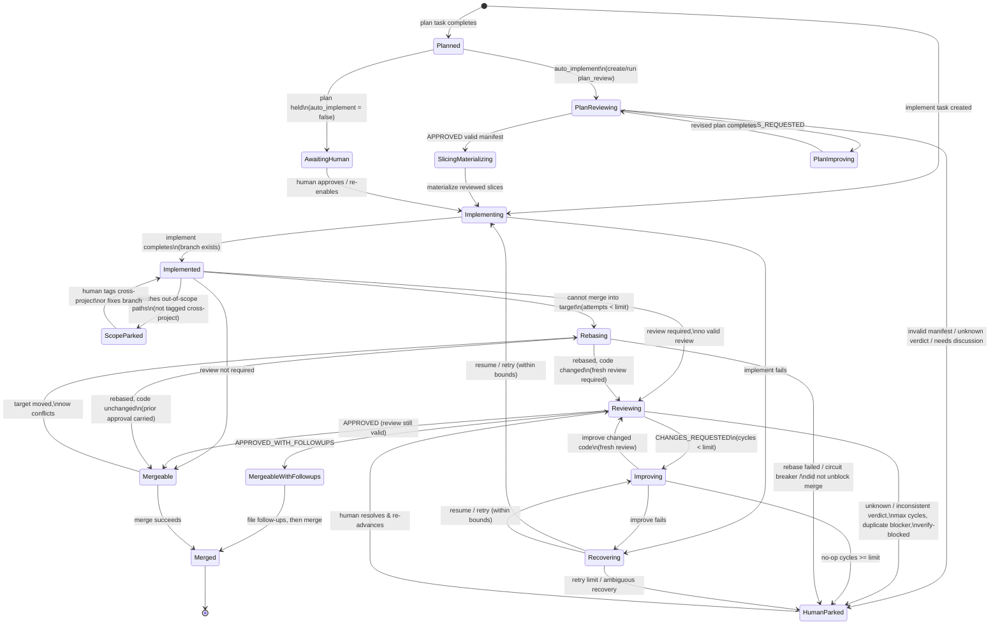

# Lifecycle state machine — overview

> **Status: Draft.** This file owns the shared model for `specs/behavior/`: vocabulary,
> system-wide invariants, the lifecycle diagram, and the consolidated human-escalation
> table. Core invariants and the five lifecycle decisions were ratified 2026-06-01 (see
> *Ratified decisions* in [lifecycle-engine.md](lifecycle-engine.md)); detailed transition
> rules remain draft pending a conformance pass against the code.

## What this models

gza turns a request into landed code by moving a **unit of work** through a lifecycle —
implement, review, improve, rebase, merge — spawning AI workers for each step and
escalating to a human only when automation cannot safely proceed.

This document specifies that lifecycle as a state machine. It is the answer to:

- When does work move from implement → review → improve?
- When do rebases happen?
- When does a merge happen?
- **When must a human get involved, and how do they clear it?**

It does **not** specify the long-running runtime loop that drives those decisions. Cycle
cadence, slot accounting, detached-worker adoption, drift restart, and pass ordering live
in [watch-supervisor.md](watch-supervisor.md). Read this overview plus
[lifecycle-engine.md](lifecycle-engine.md) for the pure per-work-unit decision function;
read [watch-supervisor.md](watch-supervisor.md) for the operational contract that drives
those decisions continuously.

## Vocabulary (the data model, abstractly)

The contract is defined over these concepts, independent of how they are stored.

- **Task** — one unit of agent execution with a type and an execution status. Tasks are
  the *atoms*; the engine spawns them and reads their results.
  - **Types:** `plan`, `plan_review`, `plan_improve`, `explore`, `implement`, `review`, `improve`, `rebase`.
  - **Execution status:** `pending` → `in_progress` → `completed` | `failed`.
- **Work unit** (a.k.a. *merge unit* / *implementation lineage*) — the *molecule*: the
  set of related tasks that together produce one mergeable change on one branch. This is
  the thing that has a lifecycle and a merge state. A work unit MUST have exactly one
  canonical merge target branch.
- **Merge state of a work unit:** `unmerged` | `merged`. Authoritative answer to "has
  this landed?" It MUST be decided from recorded lifecycle state, **not** from strict
  git ancestry (a squash-merged branch fails ancestry but is merged). See the four
  merge-state axes in `docs/internal/task-model-canonical.md`.
- **Review verdict** (on a completed `review` task): `APPROVED` |
  `APPROVED_WITH_FOLLOWUPS` | `CHANGES_REQUESTED` | `NEEDS_DISCUSSION`. Any other value
  is treated as *unknown* and escalates.
- **The engine** — the transition function. Each pass, for every unresolved work unit,
  it reads the current state and selects exactly one next action. It MUST be
  **idempotent**: running it repeatedly with no external change produces the same
  decision and never duplicates in-flight work.

## Layered state

There are two FSMs, and they MUST NOT be conflated:

1. **Task execution FSM** (per task): `pending → in_progress → completed | failed`. This
   is owned by the worker that runs the task.
2. **Work-unit lifecycle FSM** (per work unit): the diagram below. This is owned by the
   engine and is *derived* from the tasks in the unit plus git/merge state. The engine
   does not store the lifecycle state as a column; it recomputes it each pass. This is
   what makes the engine idempotent and safe to interrupt.

## The work-unit lifecycle

`AwaitingHuman`, `ScopeParked`, and `HumanParked` are the only states that require a
person. They are not failures — they are deliberate stops where automation declined to
guess. Everything else MUST progress without human input.

## Core invariants (the load-bearing rules)

These hold across the whole machine; the detailed rules in
[lifecycle-engine.md](lifecycle-engine.md) MUST NOT contradict them.

1. **Idempotent & interruptible.** Re-running the engine never duplicates in-flight work
   and never double-merges. In-progress tasks cause a wait, not a respawn.
2. **Bounded loops, always.** Every cycle (review→improve, rebase, recovery, no-op
   improve) MUST have a hard bound. When the bound is hit, the unit goes to a human
   state — it MUST NOT loop forever and MUST NOT silently give up. The *existence and
   enforcement* of each bound is invariant; the specific bound *values* are tunable
   policy knobs, not contract (see [lifecycle-engine.md](lifecycle-engine.md)).
3. **Review is the universal pre-merge checkpoint** (policy `require_review_before_merge`,
   default on). When on, an implementation work unit MUST have a current, valid review
   *whose verdict permits merge* before it can merge. The **verdict is the gate**:
   `CHANGES_REQUESTED` blocks; `APPROVED` and `APPROVED_WITH_FOLLOWUPS` permit merge — the
   latter meaning the reviewer judged the code mergeable now, with the follow-ups as
   non-blocking later work. When a verdict carries follow-ups, those follow-ups MUST be
   durably recorded as tracked work *before* the merge completes, so nothing is lost.
   This is the one human-or-agent quality gate the whole pipeline is built around.
4. **The local target branch is canonical.** Merge-ness MUST be proven against the local
   target branch, never against `origin/<target>`. The engine MUST NOT push the target
   branch as a side effect of merging.
5. **Never destroy work to make progress.** The engine MUST NOT delete branches and MUST
   NOT discard a human's uncommitted work. Branch cleanup is an operator concern.
6. **No orphans left pending.** Work that can never progress (moot, superseded, orphaned)
   MUST be surfaced for an explicit drop decision, not left silently pending — pending
   work gets run.

The pass-ordering invariant "land fresh code first" is owned by
[watch-supervisor.md](watch-supervisor.md), because it constrains the supervisor's cycle
execution order rather than the engine's per-work-unit decision function.

## Human-escalation table

Every state/reason that requires a human. This is the contract's most important table:
each row is a place we chose *not* to automate. The goal is to shrink this table over
time, so each row names what would let us remove it.

| State / reason | Trigger (intent) | How a human clears it | Path to removing the stop |
|----------------|------------------|------------------------|---------------------------|
| `AwaitingHuman` — plan held | A plan completed but auto-implement is off for this lineage. | Review the plan; start the implement task, or re-enable automatic follow-up. | Per-lineage policy: trusted plans MAY auto-implement. |
| `HumanParked` — manual plan-review creation | A completed plan needs automated plan review, but `advance_create_plan_reviews` is off and no review exists yet. | Create a `plan_review` manually or re-enable automatic plan-review creation. | Re-enable auto-creation once the project trusts the plan-review gate. |
| `HumanParked` — invalid plan-review slices | A plan review said `APPROVED`, but the slice manifest was missing, malformed, oversized, cyclic, ambiguous, or otherwise invalid. | Fix the plan review output or use `uv run gza plan-review <review-id> --edit-slices`, then materialize again. | Stronger structured prompting and deterministic validation feedback. |
| `HumanParked` — plan review needs discussion | The plan review explicitly concluded that automation cannot safely approve or revise the plan on its own. | Resolve the design ambiguity, revise the plan, then re-run plan review. | Better plan prompts and richer source context. |
| `HumanParked` — unknown plan-review verdict | The plan-review verdict could not be classified. | Re-run or correct the plan-review output. | More reliable plan-review verdict extraction. |
| `HumanParked` — plan-review cycle limit | `plan_review` → `plan_improve` loops hit `max_plan_review_cycles` without approval. | Take over the planning work, fix the design gaps, then restart the review loop. | Better plan-improve quality and better escalation hints. |
| `needs_discussion` — explore dangling | An explore task completed with no plan/implement follow-up. | Decide: drop it, or spawn follow-up work. | Auto-summarize explore output and propose next work. |
| `ScopeParked` — out of scope | The branch diff touches paths outside the work unit's declared project scope and it is not tagged `cross-project`. | Tag `cross-project` and re-advance if intended, or fix the branch. | Clearer per-task scope declaration up front. |
| `needs_discussion` — scope unverifiable | The scope of the diff could not be checked reliably (bad ref/diff). | Fix the ref/diff problem, or tag `cross-project` if the wide scope is intended. | More robust diff inspection. |
| `needs_discussion` — rebase failed | A rebase task failed and no later proof shows the work already landed. | Resolve the conflict manually, then re-advance. | Better autonomous conflict resolution. |
| `needs_discussion` — rebase did not unblock | A rebase completed but the branch still cannot merge. | Decide manually; don't let the engine re-queue an identical rebase. | Detect why the rebase was a no-op. |
| `needs_discussion` — rebase circuit breaker | Repeated rebase attempts (default bound) with no intervening progress. | Resolve manually. | Same as autonomous conflict resolution. |
| `needs_discussion` — incomplete lineage, rebase moot | The branch already contains the target tip but the lineage is still unresolved. | Inspect the lineage; resolve the real blocker. | Tighten lineage-resolution detection. |
| `needs_discussion` — review refresh blocked | A rebase changed code so the review is stale, but auto-review creation is off. | Refresh the review manually, then merge. | Re-enable auto-review creation for the lineage. |
| `needs_discussion` — inconsistent review | Verdict `APPROVED_WITH_FOLLOWUPS` but zero parsed follow-ups (self-contradictory output). | Re-review / correct the review output. | More reliable verdict extraction. |
| `needs_discussion` — verify-blocked | Review keeps failing only because the verify step times out, not on code issues, once timeout-only reviews hit the threshold and no current runner-owned passing verify evidence has already cleared the review. | Fix the environment/verify config, then re-advance. | Separate "verify infra failed" from "code rejected." |
| `max_cycles_reached` — review churn | Review→improve cycles hit the bound (`max_review_cycles`). | Take over: review and fix inline, or redirect the work. | Better improve quality; raise/redesign the bound. |
| `needs_discussion` — duplicate blocker | The same primary blocker repeats across cycles (default bound) with no progress. | Resolve the underlying issue the agent keeps missing. | Detect and break the repeat earlier. |
| `needs_discussion` — no-op improves | Improve completed without changing code, repeatedly (`max_noop_improve_cycles`); verify-only reviews clear only when the no-op improve itself captured current runner-owned passing verify evidence, and all other cases park when not tagged `allow-noop-improve`. | Decide whether the feedback is actionable; fix or drop. | Detect un-actionable feedback up front. |
| `needs_discussion` — unknown verdict | The review verdict could not be classified. | Re-review or correct the output. | More reliable verdict extraction. |
| `HumanParked` — recovery exhausted | Automatic resume/retry hit its limit or the recovery situation is ambiguous. | Diagnose the failure; resume, redirect, or drop. | Better failure classification & recovery. |

**Reason codes are contract; messages are not.** Several rows share one state
(`HumanParked`) and differ only by *reason*. Each parked action MUST carry a
machine-readable **reason code** drawn from a stable, enumerated set (see *Parked reason
codes* in [lifecycle-engine.md](lifecycle-engine.md)); automation MAY branch on the code,
and adding a new code is a spec change. The human-facing **message** that accompanies a
code is free text and MAY be reworded at any time.
</content>
