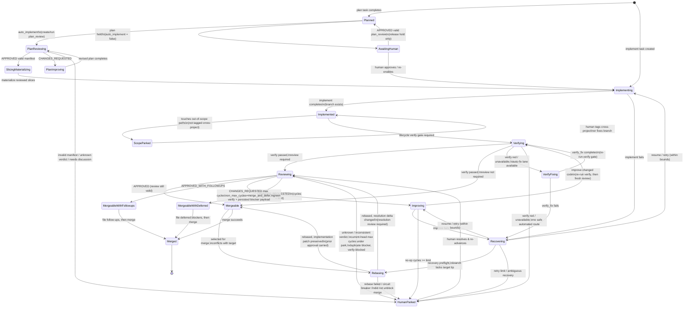

# Lifecycle state machine — overview

> **Status: Draft.** This file owns the shared model for `specs/behavior/`: vocabulary,
> system-wide invariants, the lifecycle diagram, and the consolidated human-escalation
> table. Core invariants and the five lifecycle decisions were ratified 2026-06-01 (see
> *Ratified decisions* in [lifecycle-engine.md](lifecycle-engine.md)); detailed transition
> rules remain draft pending a conformance pass against the code.

## What this models

gza turns a request into landed code by moving a **unit of work** through a lifecycle —
implement, verify, review, improve, rebase, merge — spawning AI workers for each step
and escalating to a human only when automation cannot safely proceed.

This document specifies that lifecycle as a state machine. It is the answer to:

- When does work move from implement → review → improve?
- When do rebases happen?
- When does a merge happen?
- When may an operator explicitly ask gza to land a parked-but-reviewed unit?
- **When must a human get involved, and how do they clear it?**

It does **not** specify the long-running runtime loop that drives those decisions. Cycle
cadence, slot accounting, detached-worker adoption, drift restart, and pass ordering live
in [watch-supervisor.md](watch-supervisor.md). Read this overview plus
[lifecycle-engine.md](lifecycle-engine.md) for the pure per-work-unit decision function;
read [watch-supervisor.md](watch-supervisor.md) for the operational contract that drives
those decisions continuously.

## Vocabulary (the data model, abstractly)

The contract is defined over these concepts, independent of how they are stored.

- **Task** — one unit of agent execution with a type and an execution status. Tasks are
  the *atoms*; the engine spawns them and reads their results.
  - **Types:** `plan`, `plan_review`, `plan_improve`, `explore`, `implement`, `review`, `improve`, `verify_fix`, `rebase`.
  - **Execution status:** `pending` → `in_progress` → `completed` | `failed`.
  - **Compatibility execution status:** legacy task rows MAY still carry
    `status="unmerged"` to mean "completed task whose owning work unit has not landed."
    New lifecycle decisions MUST treat that value as a compatibility task execution
    status only. It is not the canonical merge state, and every eligibility check that
    accepts it MUST also prove the owning work unit's merge state independently.
- **Work unit** (a.k.a. *merge unit* / *implementation lineage*) — the *molecule*: the
  set of related tasks that together produce one mergeable change on one branch. This is
  the thing that has a lifecycle and a merge state. A work unit MUST have exactly one
  canonical merge target branch.
- **Merge state of a work unit:** `unmerged` | `merged`. Authoritative answer to "has
  this landed?" It MUST be decided from recorded lifecycle state, **not** from strict
  git ancestry (a squash-merged branch fails ancestry but is merged). See the four
  merge-state axes in `docs/internal/task-model-canonical.md`.
- **Review verdict** (on a completed `review` task): `APPROVED` |
  `APPROVED_WITH_FOLLOWUPS` | `CHANGES_REQUESTED` | `NEEDS_DISCUSSION`. Any other value
  is treated as *unknown* and escalates.
- **The engine** — the transition function. Each pass, for every unresolved work unit,
  it reads the current state and selects exactly one next action. It MUST be
  **idempotent**: running it repeatedly with no external change produces the same
  decision and never duplicates in-flight work.

## Layered state

There are two FSMs, and they MUST NOT be conflated:

1. **Task execution FSM** (per task): `pending → in_progress → completed | failed`. This
   is owned by the worker that runs the task.
2. **Work-unit lifecycle FSM** (per work unit): the diagram below. This is owned by the
   engine and is *derived* from the tasks in the unit plus git/merge state. The engine
   does not store the lifecycle state as a column; it recomputes it each pass. This is
   what makes the engine idempotent and safe to interrupt.

## The work-unit lifecycle

```mermaid
stateDiagram-v2
    [*] --> Planned: plan task completes
    [*] --> Implementing: implement task created

    Planned --> PlanReviewing: auto_implement\n(create/run plan_review)
    Planned --> AwaitingHuman: plan held\n(auto_implement = false)
    AwaitingHuman --> Planned: APPROVED valid plan_review\n(release hold only)
    PlanReviewing --> SlicingMaterializing: APPROVED valid manifest
    SlicingMaterializing --> Implementing: materialize reviewed slices
    PlanReviewing --> PlanImproving: CHANGES_REQUESTED
    PlanReviewing --> HumanParked: invalid manifest / unknown verdict / needs discussion
    PlanImproving --> PlanReviewing: revised plan completes

    Implementing --> Implemented: implement completes\n(branch exists)
    Implementing --> Recovering: implement fails

    Implemented --> ScopeParked: touches out-of-scope paths\n(not tagged cross-project)
    Implemented --> Verifying: lifecycle verify gate required

    Verifying --> Reviewing: verify passed,\nreview required
    Verifying --> Mergeable: verify passed,\nreview not required
    Verifying --> VerifyFixing: verify red / unavailable,\nauto-fix lane available
    Verifying --> HumanParked: verify red / unavailable,\nno safe automated route

    VerifyFixing --> Verifying: verify_fix completes\n(re-run verify gate)
    VerifyFixing --> Recovering: verify_fix fails

    Reviewing --> Mergeable: APPROVED (review still valid)
    Reviewing --> MergeableWithFollowups: APPROVED_WITH_FOLLOWUPS
    Reviewing --> Improving: CHANGES_REQUESTED\n(cycles < limit)
    Reviewing --> MergeableWithDeferred: CHANGES_REQUESTED max cycles\non_max_cycles=merge_and_defer,\ngreen verify + persisted blocker payload
    Reviewing --> HumanParked: unknown / inconsistent verdict,\ncurrent-head max cycles under park,\nduplicate blocker, verify-blocked

    Improving --> Verifying: improve changed code\n(re-run verify, then fresh review)
    Improving --> Recovering: improve fails
    Improving --> HumanParked: no-op cycles >= limit

    Mergeable --> Rebasing: selected for merge,\nconflicts with target
    Recovering --> Rebasing: recovery preflight,\nbranch lacks target tip
    Rebasing --> Reviewing: rebased, resolution delta changed\n(resolution review required)
    Rebasing --> Mergeable: rebased, implementation patch preserved\n(prior approval carried)
    Rebasing --> HumanParked: rebase failed / circuit breaker /\ndid not unblock merge
    MergeableWithFollowups --> Merged: file follow-ups, then merge
    MergeableWithDeferred --> Merged: file deferred blockers, then merge
    Mergeable --> Merged: merge succeeds

    Recovering --> Implementing: resume / retry (within bounds)
    Recovering --> Improving: resume / retry (within bounds)
    Recovering --> HumanParked: retry limit / ambiguous recovery

    AwaitingHuman --> Implementing: human approves / re-enables
    HumanParked --> Reviewing: human resolves & re-advances
    ScopeParked --> Implemented: human tags cross-project\nor fixes branch

    Merged --> [*]
```

`AwaitingHuman`, `ScopeParked`, and `HumanParked` are the only states that require a
person. They are not failures — they are deliberate stops where automation declined to
guess. Everything else MUST progress without human input.

## Core invariants (the load-bearing rules)

These hold across the whole machine; the detailed rules in
[lifecycle-engine.md](lifecycle-engine.md) MUST NOT contradict them.

1. **Idempotent & interruptible.** Re-running the engine never duplicates in-flight work
   and never double-merges. In-progress tasks cause a wait, not a respawn.
   Singleton derived-child creation applies to `review`, `rebase`, and review-backed
   `improve` tasks, where active means `pending` or `in_progress`. `review` and
   review-backed `improve` singletons are keyed by parent row: each parent MUST have at
   most one active direct `based_on` child of that kind at a time. `rebase` singletons
   are keyed by the source branch being rebased: an active rebase for a branch MUST block
   a second active rebase for that same branch even when the rows have different parents.
   Duplicate singleton creation MUST route through the duplicate-child skip path and
   MUST NOT consume worker capacity. This invariant does not apply to non-singleton
   derived fan-out such as follow-up `implement` tasks, and it does not block
   comments-only `improve` refreshes when newer unresolved feedback needs a fresh pass.
2. **Bounded loops, always.** Every cycle (review→improve, rebase, recovery, no-op
   improve, writable landing transitions) MUST have a hard bound. When the bound is hit,
   the unit goes to a human state or a single explicit blocking fact — it MUST NOT loop
   forever and MUST NOT silently give up. The *existence and enforcement* of each bound is
   invariant; the specific bound *values* are tunable policy knobs, not contract. Landing
   uses a named, swappable per-invocation transition-limit policy in
   [lifecycle-engine.md](lifecycle-engine.md#8a--operator-triggered-land).
3. **Merge is a two-gate decision.** For an implementation work unit whose review gate is
   enabled, ordinary lifecycle MUST have current green evidence for both:
   - the **code-review gate**: a current, valid review whose verdict permits merge
     (`APPROVED` or `APPROVED_WITH_FOLLOWUPS`);
   - the **verify gate**: current runner-owned verify evidence for the current
     implementation head and verify-gate identity.
   When `require_review_before_merge=false` disables the review gate for that
   implementation-owned lineage, the verify gate remains mandatory and that no-review
   merge path is an explicit exception to the ordinary two-gate rule. The other explicit
   exception is exact-state, operator-triggered guarded landing: `gza land --policy
   guarded` MAY merge a current `CHANGES_REQUESTED` code-review gate only after the
   guarded landing contract in [lifecycle-engine.md](lifecycle-engine.md#8a--operator-triggered-land)
   obtains a current green verify gate, any mandatory spec-coherence gate, and a durable
   `LAND` judgment for that exact source/target/review/verify/blocker identity. This
   exception is operator-scoped only; `advance` and `watch` remain strict and MUST NOT use
   guarded landing authority. The current default `on_max_cycles=park` preserves the
   ordinary review gate at `max_review_cycles`; the narrow unattended opt-in
   `on_max_cycles=merge_and_defer` MAY bypass review approval only for ordinary
   current-head capped `CHANGES_REQUESTED` reviews after the capped-review contract in
   [lifecycle-engine.md](lifecycle-engine.md#6--review-state) proves fresh green
   lifecycle-owned verify evidence for the exact current head and a deterministic
   persisted blocker payload, then emits an annotated `merge` action. The merge executor
   MUST create or reuse every required deferred-blocker task before promotion,
   already-merged mutation, or merge-unit finalization records merge success. Missing or
   stale verify evidence is not yet eligible and MUST run the normal pre-merge verify
   path; red or unavailable verify evidence is not deferable.
   `APPROVED_WITH_FOLLOWUPS` permits merge only when the follow-up tasks are durably
   recorded *before* the merge completes, so nothing is lost. Historical compatibility
   handling for older review-coupled verify blockers MUST NOT be read as widening this
   ordinary two-gate precondition.
4. **The local target branch is canonical.** Merge-ness MUST be proven against the local
   target branch, never against `origin/<target>`. The engine MUST NOT push the target
   branch as a side effect of merging.
5. **Never destroy work to make progress.** The engine MUST NOT delete branches and MUST
   NOT discard a human's uncommitted work. Branch cleanup is an operator concern.
6. **No orphans left pending.** Work that can never progress (moot, superseded, orphaned)
   MUST be surfaced for an explicit drop decision, not left silently pending — pending
   work gets run.

The pass-ordering invariant "land fresh code first" is owned by
[watch-supervisor.md](watch-supervisor.md), because it constrains the supervisor's cycle
execution order rather than the engine's per-work-unit decision function.

## Operator-triggered landing

`uv run gza land <task-id>` is a manual, synchronous operator command for one selected
merge unit. It is not part of ordinary unattended lifecycle cadence. The command resolves
the selected task to its canonical active merge unit, uses the unit's canonical local
target branch, and either finishes idempotently when authoritative merge state is already
`merged` or runs the guarded landing contract specified in
[lifecycle-engine.md](lifecycle-engine.md#8a--operator-triggered-land).

`gza land` has two per-run policies:

- `guarded` (default) MAY escalate beyond strict lifecycle only after deterministic
  mechanical gates pass and a durable landing judgment says the original graded ask is
  satisfied and every remaining blocker is safe to defer.
- `strict` uses the same orchestration but MUST NOT override parked lifecycle gates and
  MUST NOT defer open blockers.

Running `gza land` is the operator's explicit authorization for that selected unit only.
It does not change the normal two-gate merge invariant for `advance` or `watch`: unattended
automation remains strict, never creates landing judgments, and never bypasses parked
lifecycle gates merely because guarded landing exists. The only unattended blocker
deferral allowed by this contract is the narrow `on_max_cycles=merge_and_defer`
exception governed by the capped-review proof rules in
[lifecycle-engine.md](lifecycle-engine.md#6--review-state).

Successful guarded escalation is auditable as distinct merge provenance. A strict or
non-escalated landing records `manual_land`; a guarded landing that defers blockers or
overrides an eligible churn park records `manual_land_escalated` and links the landing
judgment and deferred task IDs.

`land` command refusals are operator-facing command results, not parked lifecycle states.
They MUST still use a stable machine-readable `LandBlocked` result with one reason code,
one human fact, and evidence references; see the command-refusal table below and
[lifecycle-engine.md](lifecycle-engine.md#8a--operator-triggered-land) for the total
precedence order. A `LandBlocked` result does not by itself clear or create a parked
row. The human clears it by changing the cited state, evidence, or configuration and
rerunning the command.

## Human-escalation table

Every state/reason that requires a human. This is the contract's most important table:
each row is a place we chose *not* to automate. The goal is to shrink this table over
time, so each row names what would let us remove it.

| State / reason | Trigger (intent) | How a human clears it | Path to removing the stop |
|----------------|------------------|------------------------|---------------------------|
| `AwaitingHuman` — plan held | A plan completed but auto-implement is off for this lineage. | Review the plan; start the implement task, or re-enable automatic follow-up. | Per-lineage policy: trusted plans MAY auto-implement. |
| `HumanParked` — manual plan-review creation | A completed plan needs automated plan review, but `advance_create_plan_reviews` is off and no review exists yet. | Create a `plan_review` manually or re-enable automatic plan-review creation. | Re-enable auto-creation once the project trusts the plan-review gate. |
| `HumanParked` — invalid plan-review slices | A plan review said `APPROVED`, but the slice manifest was missing, malformed, oversized, cyclic, ambiguous, or otherwise invalid. | Fix the plan review output or use `uv run gza plan-review <review-id> --edit-slices`, then materialize again. | Stronger structured prompting and deterministic validation feedback. |
| `HumanParked` — plan review needs discussion | The plan review explicitly concluded that automation cannot safely approve or revise the plan on its own. | Resolve the design ambiguity, revise the plan, then re-run plan review. | Better plan prompts and richer source context. |
| `HumanParked` — unknown plan-review verdict | The plan-review verdict could not be classified. | Re-run or correct the plan-review output. | More reliable plan-review verdict extraction. |
| `needs_discussion` — explore dangling | An explore task completed with no plan/implement follow-up. | Decide: drop it, or spawn follow-up work. | Auto-summarize explore output and propose next work. |
| `ScopeParked` — out of scope | The branch diff touches paths outside the work unit's declared project scope and it is not explicitly or implicitly cross-project. | Tag `cross-project` and re-advance if intended, or fix the branch. | Clearer per-task scope declaration up front. |
| `needs_discussion` — scope unverifiable | The scope of the diff could not be checked reliably (bad ref/diff). | Fix the ref/diff problem; tag `cross-project` only when the task is not already explicitly or implicitly cross-project and the wide scope is intended. | More robust diff inspection. |
| `needs_discussion` — rebase failed | A rebase task failed and no later proof shows the work already landed. | Resolve the conflict manually, then re-advance. | Better autonomous conflict resolution. |
| `needs_discussion` — rebase did not unblock | A rebase completed but the branch still cannot merge. | Decide manually; don't let the engine re-queue an identical rebase. | Detect why the rebase was a no-op. |
| `needs_discussion` — rebase circuit breaker | Repeated rebase attempts (default bound) with no intervening progress. | Resolve manually. | Same as autonomous conflict resolution. |
| `needs_discussion` — incomplete lineage, rebase moot | The branch already contains the target tip but the lineage is still unresolved. | Inspect the lineage; resolve the real blocker. | Tighten lineage-resolution detection. |
| `needs_discussion` — review refresh blocked | A completed rebase changed the implementation patch or conflict-resolution delta after the latest completed review, so a narrower refresh review is required, but auto-review creation is off. Target movement alone does not trigger this row. | Refresh the review manually, then merge. | Re-enable auto-review creation for the lineage. |
| `needs_discussion` — review freshness unverified | The engine could not verify whether the latest completed review still matches the current implementation head after a code-changing lineage event, so freshness is unknown. Target movement alone does not trigger this row. | Fix the branch-head probe problem or refresh review state manually, then re-advance. | More robust git freshness probing and better operator diagnostics. |
| `needs_discussion` — inconsistent review | Verdict `APPROVED_WITH_FOLLOWUPS` but zero parsed follow-ups (self-contradictory output). | Re-review / correct the review output. | More reliable verdict extraction. |
| `needs_discussion` — verify failed needs fix | The lifecycle-owned verify gate is red before review can proceed, but automation cannot safely create or continue the current `verify_fix` lane. | Inspect the failing verify evidence, repair the branch or environment, then re-advance. | Keep verify failures on a dedicated remediation lane instead of treating them as review blockers. |
| `needs_discussion` — verify fix failed | One completed same-epoch `verify_fix` already ran, and the current verify gate is still red for that same implementation head / verify identity. | Inspect the failing verify evidence and the completed `verify_fix`, then take over manually. | Better targeted remediation quality and better verify diagnostics. |
| `needs_discussion` — verify unavailable | The lifecycle-owned verify gate could not be run safely for the current implementation head, or remained unavailable after one same-epoch `verify_fix`. | Fix the environment or configuration problem, then re-advance. | More reliable verify setup and environment diagnostics. |
| `max_cycles_reached` — review churn | Review→improve cycles within the current durable-progress epoch hit the bound (`max_review_cycles`) and no stale-review refresh path is available. Under the current default `on_max_cycles=park`, this remains a manual-attention stop. Under opt-in `on_max_cycles=merge_and_defer`, eligible ordinary current-head code/resolution reviews instead follow the audited merge-and-defer path after fresh green verify and deterministic persisted blocker payload proof; the executor must durably create or reuse the blocker tasks before promotion, already-merged mutation, or merge-unit finalization. Missing or stale verify evidence goes through the normal pre-merge verify path first, while red or unavailable verify evidence remains non-deferred. | Take over: review and fix inline, or redirect the work. | Better improve quality; raise/redesign the bound. |
| `needs_discussion` — blocker adjudication needed | A disputed non-verify CODE blocker reached independent adjudication, but the adjudicator returned `NEEDS_HUMAN`, failed, or produced an unsafe/unparseable result. | Review the blocker, the dispute evidence, and the adjudication output; then fix, override, or restate the blocker explicitly. | Reliable adjudication worker plus durable blocker-resolution state. |
| `needs_discussion` — duplicate blocker | The same primary blocker repeats across cycles (default bound) with no progress. | Resolve the underlying issue the agent keeps missing. | Detect and break the repeat earlier. |
| `needs_discussion` — no-op improves | Improve completed without changing code, repeatedly (`max_noop_improve_cycles`). Disputed non-verify CODE blockers route to adjudication first; remaining no-op cases still park. Legacy compatibility handling for verify-only blocked reviews does not make repeated no-op improves a normal merge path. | Decide whether the feedback is actionable; fix or drop. | Detect un-actionable feedback up front. |
| `needs_discussion` — unknown verdict | The review verdict could not be classified. | Re-review or correct the output. | More reliable verdict extraction. |
| `HumanParked` — recovery exhausted | Automatic resume/retry hit its limit or the recovery situation is ambiguous. | Diagnose the failure; resume, redirect, or drop. | Better failure classification & recovery. |

## Operator command-refusal table

These are stable direct-command refusals. They are not lifecycle parked states unless a
separate lifecycle rule also records one. Every row MUST render as a typed result with
`reason_code`, one human-readable `fact`, and `evidence_refs`.

| Result / reason code | Trigger | How a human clears it | Path to removing the stop |
|----------------------|---------|------------------------|---------------------------|
| `LandBlocked` — `identity-proof-unavailable` | The selected task, active merge unit, representative, source, target, dependency, or project-scope proof is missing, ambiguous, or out of scope. | Fix task/merge-unit/source metadata or branch refs; tag `cross-project` only when the scope policy allows it and the wide scope is intended. | More complete canonical merge-unit and scope-proof repair. |
| `LandBlocked` — `dirty-checkout` | The tracked checkout is not clean at a required landing preflight. | Save or discard unrelated local changes, then rerun `land`. | Better isolated preflight checkouts. |
| `LandBlocked` — `rebase-or-conflict` | Required ancestry, rebase, rebase outcome, or clean-merge proof failed or became unverifiable. | Resolve the rebase/conflict or repair the durable outcome proof, then rerun. | Better autonomous conflict resolution and outcome persistence. |
| `LandBlocked` — `verify-unavailable-or-red` | Current source verify evidence is missing, stale, red, malformed, unavailable, or could not be acquired/reused. | Fix the branch or environment and rerun verify/land. | More reliable verify acquisition and diagnostics. |
| `LandBlocked` — `required-review-unavailable` | Required spec-coherence, code, or resolution review evidence is missing, stale, mismatched, failed, malformed, unknown, unavailable, `NEEDS_DISCUSSION`, identity-mismatched, or could not be acquired/reused. A current, parseable plain-full or resolution `CHANGES_REQUESTED` review is not unavailable when all guarded judgment prerequisites are eligible; strict mode and nondeferrable blocker handling are later rows. | Let the exact active review finish, enable acquisition, or repair/re-run the required review. | More reliable exact-identity review reuse and creation. |
| `LandBlocked` — `nondeferrable-blocker` | Strict mode sees any current plain-full or resolution `CHANGES_REQUESTED` review blocker, or guarded policy sees an open blocker that the contract does not allow deferring. | Fix or explicitly resolve the blocker, then rerun. | Better scoped blocker adjudication and review quality. |
| `LandBlocked` — `policy-or-judge-refused` | Guarded judgment is disabled, unavailable, malformed, not exact, returns `BLOCK`/`NEEDS_HUMAN`, omits required blocker decisions, or required judgment reuse is invalid. A guarded `LAND` judgment permits continuing to materialization/final preflight; guarded `BLOCK` and `NEEDS_HUMAN` map here. | Inspect the judgment evidence or run strict/manual remediation. | Better judgment prompting and identity validation. |
| `LandBlocked` — `materialization-or-persistence-failed` | Required ordinary follow-up/deferred task creation, exact-key reuse validation, reconciliation, or persistence failed before merge mutation. | Repair task storage/reuse state and rerun. | Transactional materialization helpers. |
| `LandBlocked` — `bounded-attempt-exhausted` | The visited fingerprint repeats or the `LandingTransitionLimitPolicy` transition cap is exhausted. | Inspect the repeated state/evidence refs, change the blocking state manually, then rerun. | More complete progress detection and phase-specific refusal reasons. |
| `LandBlocked` — `merge-failed` | Final merge or mark-merged precondition failed before durable merge-state mutation. | Fix the cited merge failure and rerun. | Better shared merge executor diagnostics. |

**Reason codes are contract; messages are not.** Several rows share one state
(`HumanParked`) and differ only by *reason*. Each parked action MUST carry a
machine-readable **reason code** drawn from a stable, enumerated set (see *Parked reason
codes* in [lifecycle-engine.md](lifecycle-engine.md)); automation MAY branch on the code,
and adding a new code is a spec change. The human-facing **message** that accompanies a
code is free text and MAY be reworded at any time.
</content>
